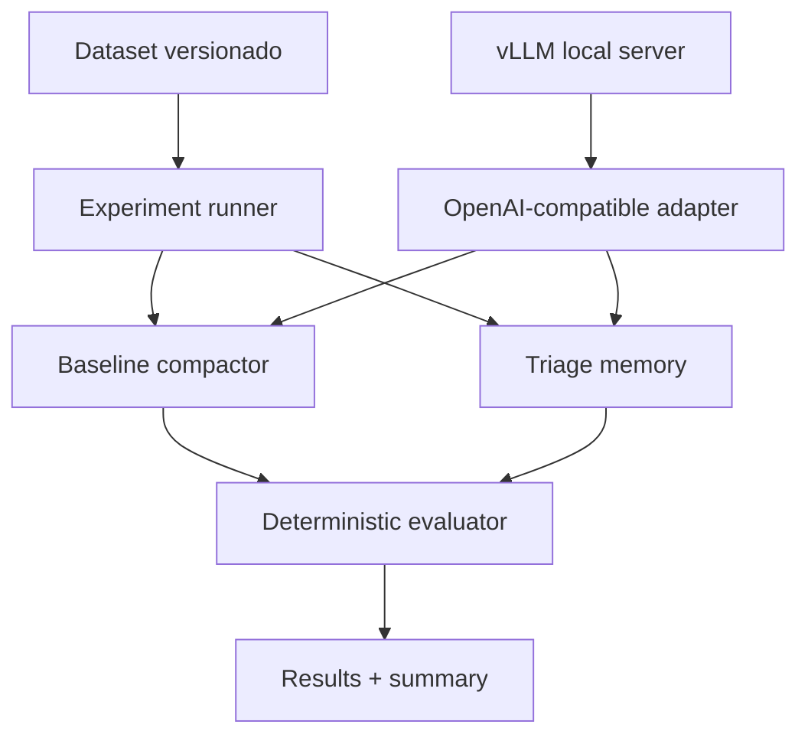

# Arquitectura y decisiones

## 1. Vista lógica

## 2. Componentes

- `domain`: `MemoryItem`, políticas y resultados. No conoce HTTP.
- `strategies`: interfaz `MemoryStrategy` y las implementaciones `BaselineStrategy` y `TriageStrategy`.
- `llm`: puerto `TextCompactor` y adaptadores real/falso.
- `evaluation`: comprobaciones deterministas, métricas y comparación.
- `runner`: orquesta rondas y perturbaciones.
- `reporting`: JSON completo y resumen Markdown.
- `vLLM`: proceso local independiente que sirve el modelo; no se incrusta en el dominio ni en el runner.

## 3. Políticas de triage

| Tipo | Política MVP | Motivo |
|---|---|---|
| Constraint | `pin` | Una regla crítica no debe depender de una paráfrasis probabilística |
| Decision | `pin` si es crítica; si no, `compact` | Preserva decisiones irreversibles sin inflar todo el contexto |
| Episode | `compact` | El detalle temporal suele admitir pérdida controlada |
| Evidence | `retrieve` | Se conserva íntegra fuera del contexto activo |
| Preference | `compact` | Puede resumirse, salvo que se marque crítica |

## 4. Soluciones ordenadas por adecuación

### 1. Memoria tipada con políticas deterministas — elegida

Es la solución más adecuada porque prueba directamente la hipótesis arquitectónica: clasificación, retención diferenciada y constraints fijadas. Es pequeña, observable y trasladable a sistemas empresariales.

**Consideración final:** el MVP debe mantener la recuperación simple —por etiquetas o términos— para no confundir el efecto del triage con la calidad de un vector store.

### 2. Doble prompt de compactación con instrucciones de preservación

Es fácil de implementar sobre el cliente existente y constituye un baseline reforzado útil. Sin embargo, una instrucción como “no pierdas reglas” sigue delegando una garantía de seguridad en un comportamiento probabilístico.

**Consideración final:** conviene añadirla más adelante como tercer brazo, no sustituir con ella al triage.

### 3. Recuperación vectorial de toda la memoria

Puede escalar mejor y recuperar conocimiento relevante, pero no garantiza que una constraint aparezca siempre en el contexto. Añade embeddings, indexado y nuevas variables al experimento.

**Consideración final:** apropiada para una segunda fase centrada en knowledge retrieval, no para probar primero la conservación de reglas.

### 4. Aumentar la ventana de contexto y evitar compactar

Reduce el problema temporalmente, pero aumenta coste y latencia y no elimina la degradación cuando se alcance el nuevo límite. Tampoco introduce lifecycle explícito.

**Consideración final:** solo sirve como control o aplazamiento, no como arquitectura de memoria persistente.

## 5. Decisiones de diseño

- La evaluación primaria será determinista. Un juez LLM opcional puede añadirse después, pero no decidirá por sí solo el resultado.
- La unidad de análisis es el `MemoryItem`, nunca una palabra aislada.
- El runner guardará el texto generado en cada ronda para permitir auditoría.
- El baseline recibirá toda la memoria serializada; triage reconstruirá el contexto activo desde stores separados.
- El cliente LLM se envolverá tras un puerto y no se importará directamente desde dominio.

## 6. Relación con el código adjunto

El código adjunto no será una dependencia. Solo confirma el contrato general de un endpoint `/chat/completions`. La PoC implementará un adaptador propio con:

1. SDK `openai` apuntando por defecto a `http://localhost:8000/v1`.
2. `messages`, temperatura, semilla y límite de salida explícitos.
3. Timeout y errores propios del adaptador.
4. Respuesta reducida a texto más metadatos de uso.
5. Inyección del adaptador para sustituirlo por `FakeCompactor` en tests.

No se realizará una petición de validación dentro del constructor: la salud del servidor se comprobará mediante un comando explícito.
