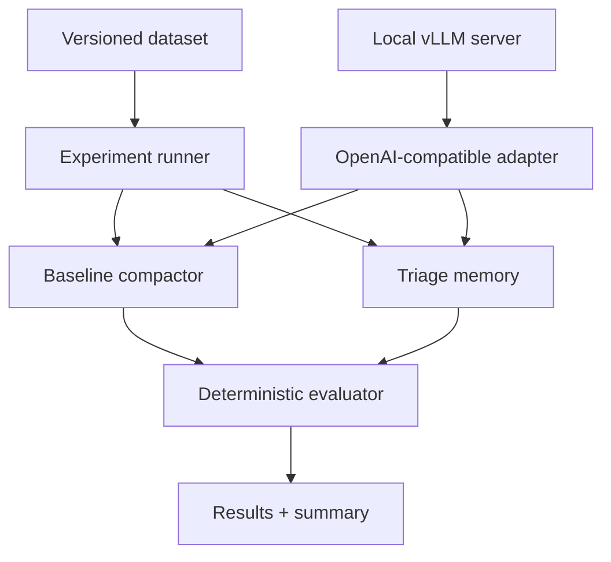

# Architecture and Decisions

## 1. Logical View

## 2. Components

- `domain`: `MemoryItem`, policies, and results. It knows nothing about HTTP.
- `strategies`: `MemoryStrategy` interface and `BaselineStrategy` and `TriageStrategy` implementations.
- `llm`: `TextCompactor` port and real/fake adapters.
- `evaluation`: deterministic checks, metrics, and comparison.
- `runner`: orchestrates rounds and perturbations.
- `reporting`: complete JSON and Markdown summary.
- `vLLM`: independent local process serving the model; it is not embedded in the domain or runner.

## 3. Triage Policies

| Type | MVP Policy | Reason |
|---|---|---|
| Constraint | `pin` | A critical rule must not depend on a probabilistic paraphrase |
| Decision | `pin` if critical; otherwise `compact` | Preserves irreversible decisions without bloating the entire context |
| Episode | `compact` | Temporal detail usually permits controlled loss |
| Evidence | `retrieve` | Preserved intact outside the active context |
| Preference | `compact` | Can be summarized unless marked critical |

## 4. Solutions Ordered by Fit

### 1. Typed Memory with Deterministic Policies - Selected

This is the most suitable solution because it directly tests the architectural hypothesis: classification, differentiated retention, and pinned constraints. It is small, observable, and transferable to enterprise systems.

**Final consideration:** the MVP should keep retrieval simple - by labels or terms - so the effect of triage is not confused with vector-store quality.

### 2. Dual Compaction Prompt with Preservation Instructions

It is easy to implement on the existing client and provides a useful reinforced baseline. However, an instruction such as "do not lose rules" still delegates a safety guarantee to probabilistic behavior.

**Final consideration:** add it later as a third arm rather than replacing triage with it.

### 3. Vector Retrieval of All Memory

It may scale better and retrieve relevant knowledge, but it does not guarantee that a constraint always appears in context. It adds embeddings, indexing, and new variables to the experiment.

**Final consideration:** appropriate for a second phase focused on knowledge retrieval, not for initially testing rule preservation.

### 4. Increase the Context Window and Avoid Compaction

It reduces the problem temporarily, but increases cost and latency and does not eliminate degradation when the new limit is reached. It also introduces no explicit lifecycle.

**Final consideration:** useful only as a control or postponement, not as a persistent-memory architecture.

## 5. Design Decisions

- The primary evaluation will be deterministic. An optional LLM judge may be added later, but it will not decide the result on its own.
- The unit of analysis is the `MemoryItem`, never an isolated word.
- The runner will store the text generated in each round to support auditing.
- The baseline will receive all serialized memory; triage will reconstruct active context from separate stores.
- The LLM client will be wrapped behind a port and will not be imported directly from the domain.

## 6. Relationship to the Attached Code

The attached code will not be a dependency. It only confirms the general contract of a `/chat/completions` endpoint. The PoC will implement its own adapter with:

1. `openai` SDK pointing by default to `http://localhost:8000/v1`.
2. Explicit `messages`, temperature, seed, and output limit.
3. Adapter-specific timeout and errors.
4. Response reduced to text plus usage metadata.
5. Adapter injection to replace it with `FakeCompactor` in tests.

No validation request will be made inside the constructor: server health will be checked through an explicit command.
